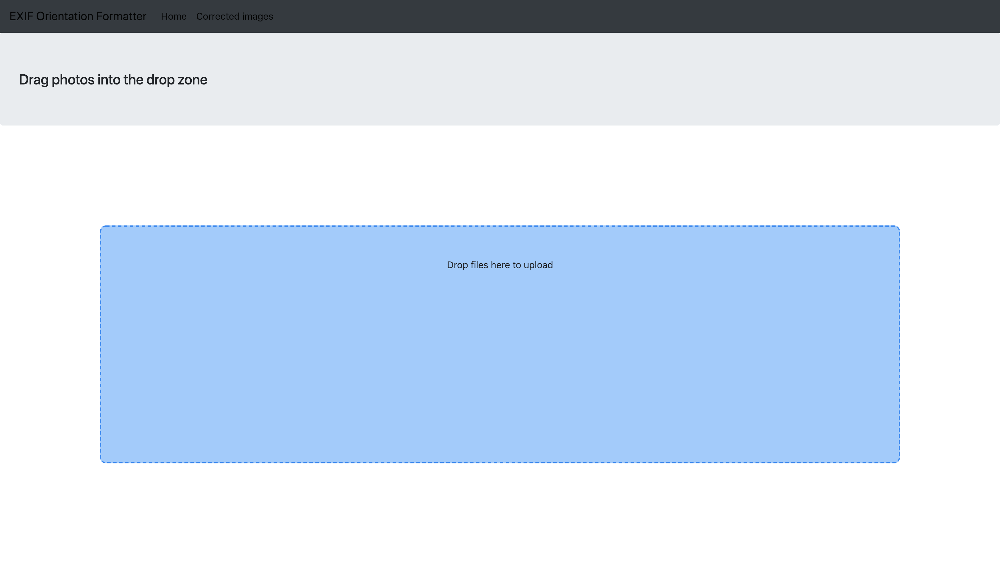

# EXIF Orientation Formatter

## Flask powered EXIF formating server

### About EXIF Dataß
- **EXIF data (EXchangeable Image Format)** is meta data generated by cameras for every picture taken, this data can create problems for pictures on websites by altering their orientation.

<p align = 'center'>
    
</p>

- For example an image might appear flipped upside down or rotated on an angle, a result of the **orientation tag** in the EXIF data which is read by the browser and later applied to the picture.


### About this application / microservice

<p align = 'center'>
    
</p>

- This application extracts the EXIF tags from the uploaded image and applies the appropriate rotations to correct the orientation
- The corrected images can be displayed on the client (transformed.html), however there is currently no production server implemented as of yet and transformed pictures can be accessed in the transformed folder 
- I used Flask for this server to send images over HTTP from a simple client endpoint, however the methods which apply the transformations are not bound to any Flask specific code and can be used seperately.
- I made this application as a microservice for the company I work with which deals with mass image dumps for their web application.

```

exifs = dict(i._getexif().items())
# check for Orientation tag in EXIF
for orientation in PIL.ExifTags.TAGS.keys():
    if PIL.ExifTags.TAGS[orientation]=='Orientation':
        break
    if exifs[orientation] == 3:
        i = i.rotate(180, expand = True)
    elif exifs[orientation] == 6:
        i = i.rotate(270, expand = True)
    elif exifs[orientation] == 8:
        i = i.rotate(90, expand = True)
    elif exifs[orientation] == 1:
        print("orientation is fine")

```
- Code for applying transformations

### Software
- **Python 3** along with **Flask** to write the application 
- **PIL / Pillow** for Python to extract EXIF data and apply the appropriate transformations

### Author
- **Sasank Ganapathiraju**
